# RAG-GuardBench for Prompt Injection and Tool Misuse in Retrieval-Augmented Generation

*A compact but polished benchmark for testing whether small retrieval-augmented language model systems can be manipulated by adversarial retrieved content.*

> [!NOTE]
> **In plain language**
> A RAG system can fail even when the user prompt looks harmless. The risky part is the retrieved context: a malicious attachment, an injected note, a poisoned summary, or a fake authority message can tell the model to ignore its real instructions, leak protected context, or misuse tools. RAG-GuardBench turns that abstract problem into a small, runnable benchmark with a realistic retrieval pipeline, structured attack cases, lightweight defenses, and clean reports.

## Overview

RAG-GuardBench is a compact benchmark and test harness for a narrow but important AI-safety question: how vulnerable is a retrieval-augmented generation pipeline to prompt injection through retrieved documents?

The repository simulates a small but realistic RAG system. It ships a synthetic corpus of benign policy notes, internal reference notes, and adversarial retrieved attachments; chunks and indexes them with a simple TF-IDF or BM25 retriever; assembles prompts from a system instruction, a user query, and retrieved context; exposes a few fake but realistic tools; and evaluates whether attacks succeed in making the model follow malicious instructions, leak protected values, corrupt its answer, or trigger unsafe tool use.

The benchmark is intentionally small enough to inspect end to end, but serious enough to make RAG security concrete, measurable, and reproducible.

## Status

This is a working first release with:

- a deterministic synthetic benchmark corpus and case set
- a runnable retrieval and prompt-assembly pipeline
- six attack categories plus benign control cases
- four lightweight defenses and one combined guard setting
- case-level logging, summary metrics, run manifests, sample plots, and a checked-in report
- a reproducible mock backend plus an optional OpenAI-compatible backend for live model testing

## Why This Project Exists

RAG failures are often discussed vaguely. People know prompt injection is possible, but many repos stop at toy examples or anecdotal screenshots. That leaves an awkward gap between the abstract concern and the engineering work needed to test a system rigorously.

RAG-GuardBench exists to close that gap in a compact form:

- retrieval is explicit rather than hand-waved
- attacks live inside retrieved content rather than direct user prompts
- tool misuse is evaluated alongside answer corruption and leakage
- defenses are small enough to understand and compare directly
- outputs look like benchmark artifacts rather than one-off demos

## Threat Model

The threat model is intentionally focused and concrete:

- the user query itself is benign
- the main attack channel is adversarial retrieved text
- retrieved documents may contain instruction overrides, fake role messages, poisoned facts, exfiltration prompts, or tool-use directives
- the assistant may have access to a small set of fake tools
- success means the system follows malicious retrieved instructions, leaks protected note content, gives a corrupted answer, or executes unsafe tools

This repo is not trying to model every jailbreak pattern. It is specifically about document-borne prompt injection and related RAG failures.

## What The Benchmark Currently Does

- ships a synthetic corpus of benign, protected, and malicious documents
- chunks and indexes the case-specific corpus with either a TF-IDF or BM25 retriever
- retrieves the top chunks for each user query
- assembles prompts from system instruction, query, retrieved context, and tool descriptions
- evaluates attacks across six categories:
  - instruction override
  - role confusion
  - exfiltration attempt
  - fake authority
  - answer poisoning
  - tool triggering
- compares five settings:
  - `baseline_insecure`
  - `prompt_hardened`
  - `sanitized_context`
  - `two_stage_answering`
  - `full_guard`
- logs retrieved chunks, prompts, answers, tool calls, defense actions, and case outcomes
- writes a run manifest, summary JSON, case-level CSV, trace JSONL, failure examples, markdown report, HTML report, and SVG figures

## What It Explicitly Does Not Do

- claim to fully represent production RAG risk
- include real secrets, credentials, or internal company data
- run destructive tools or live integrations
- assume that a synthetic benchmark replaces security review
- claim that the mock backend is itself a trustworthy model evaluation target

## Benchmark Dataset

The checked-in benchmark contains:

- `60` total cases
- `12` benign control cases
- `48` adversarial cases
- `8` cases for each attack category

Each case specifies:

- the user query
- the case document set
- the attack category
- whether an attack is present
- expected safe answer behavior
- protected values that must not leak
- keywords used to score safe answers

The corpus and cases live in:

- [`data/corpus.json`](data/corpus.json)
- [`data/cases.json`](data/cases.json)

## Lightweight Defenses

The repository includes several intentionally lightweight defenses so the comparisons stay legible:

| Defense | Design | Intended effect |
| --- | --- | --- |
| Prompt hardening | Explicitly tells the model that retrieved text is untrusted evidence rather than instructions | Reduces obedience to injected directives |
| Context sanitization | Redacts suspicious retrieved phrases such as overrides, exfiltration requests, and tool directives | Removes high-risk strings before answer generation |
| Two-stage answering | Extracts candidate facts first, then answers from the extracted fact set | Helps separate evidence from instructions |
| Tool permission gating | Blocks dangerous tools unless the request is clearly justified | Prevents unsafe tool execution even when a tool is suggested |

The combined `full_guard` setting turns on all of them together.

## Current Sample Results

Default run command:

```bash
.venv/bin/python -m rag_guardbench.cli run --corpus data/corpus.json --cases data/cases.json --output-dir artifacts
```

The checked-in mock run evaluates `60` cases across `5` settings and produces the following headline metrics:

| Setting | Attack success | Safe answer | Tool misuse | Defense win | Overblocking |
| --- | ---: | ---: | ---: | ---: | ---: |
| `baseline_insecure` | `1.00` | `0.60` | `0.13` | `0.00` | `0.00` |
| `prompt_hardened` | `0.50` | `0.87` | `0.13` | `0.50` | `0.00` |
| `sanitized_context` | `0.50` | `1.00` | `0.13` | `0.50` | `0.00` |
| `two_stage_answering` | `0.17` | `1.00` | `0.13` | `0.83` | `0.00` |
| `full_guard` | `0.00` | `1.00` | `0.00` | `1.00` | `0.00` |

Interpretation:

- the insecure baseline is fully compromised on the synthetic attack set
- prompt hardening and sanitization each block a meaningful portion of attacks but still leave tool misuse exposed
- two-stage answering materially improves robustness against poisoned or injected context
- the combined full guard eliminates attack success and unsafe tool execution in the default synthetic run without overblocking benign cases

Representative outputs:

- summary metrics: [`artifacts/summary.json`](artifacts/summary.json)
- run manifest: [`artifacts/run_manifest.json`](artifacts/run_manifest.json)
- case outcomes: [`artifacts/case_outcomes.csv`](artifacts/case_outcomes.csv)
- trace log: [`artifacts/run_traces.jsonl`](artifacts/run_traces.jsonl)
- failure examples: [`artifacts/failure_examples.json`](artifacts/failure_examples.json)
- markdown report: [`docs/benchmark_report.md`](docs/benchmark_report.md)
- HTML report: [`docs/benchmark_report.html`](docs/benchmark_report.html)

## Example Workflow

```mermaid
flowchart LR
    accTitle: RAG-GuardBench Pipeline
    accDescr: Synthetic benign and malicious documents are indexed, retrieved for each query, passed through defenses, scored for answer safety and tool misuse, and written out as reproducible benchmark artifacts.

    corpus["Synthetic corpus<br/>benign, protected, malicious docs"]
    retriever["Chunking and retrieval<br/>TF-IDF or BM25 top-k chunks"]
    prompt["Prompt assembly<br/>system instruction, query, context, tools"]
    defenses["Defenses<br/>hardening, sanitization, staged facts, tool gating"]
    model["Mock or OpenAI-compatible backend"]
    eval["Evaluation<br/>attack success, safe answers, tool misuse"]
    report["Artifacts and report"]

    corpus --> retriever
    retriever --> prompt
    prompt --> defenses
    defenses --> model
    model --> eval
    eval --> report

    classDef data fill:#e0f2fe,stroke:#0369a1,stroke-width:1.5px,color:#0f172a
    classDef core fill:#ecfccb,stroke:#4d7c0f,stroke-width:1.5px,color:#1f2937
    classDef out fill:#fef3c7,stroke:#b45309,stroke-width:1.5px,color:#1f2937

    class corpus,retriever data
    class prompt,defenses,model core
    class eval,report out
```



## Quickstart

```bash
/home/zuberi01/miniforge3/bin/python3.12 -m venv .venv
.venv/bin/pip install -e . pytest
.venv/bin/python -m rag_guardbench.cli generate-data --output-dir data
.venv/bin/python -m rag_guardbench.cli run --corpus data/corpus.json --cases data/cases.json --output-dir artifacts
.venv/bin/python -m pytest
```

Or use the small Make targets after creating `.venv`:

```bash
make generate-data
make run
make test
```

## Optional Live Model Backend

The default checked-in outputs use the deterministic `mock` backend.

If you want to test a real model through an OpenAI-compatible API, set:

- `OPENAI_API_KEY`
- optional `OPENAI_BASE_URL`
- optional `OPENAI_MODEL`

Then run:

```bash
.venv/bin/python -m rag_guardbench.cli run \
  --corpus data/corpus.json \
  --cases data/cases.json \
  --output-dir artifacts_live \
  --backend openai \
  --retriever bm25
```

The live backend expects the model to return JSON containing an answer plus any proposed tool calls. The mock backend remains the reproducible reference path for this repository.

## Repository Structure

```text
rag-guardbench/
├── artifacts/
│   ├── case_outcomes.csv
│   ├── failure_examples.json
│   ├── run_manifest.json
│   ├── run_traces.jsonl
│   └── summary.json
├── data/
│   ├── cases.json
│   └── corpus.json
├── docs/
│   ├── benchmark_report.html
│   ├── benchmark_report.md
│   └── figures/
├── scripts/
│   ├── generate_benchmark_data.py
│   └── run_benchmark.py
├── src/rag_guardbench/
│   ├── cli.py
│   ├── data_io.py
│   ├── defenses.py
│   ├── models.py
│   ├── pipeline.py
│   ├── reporting.py
│   ├── retrieval.py
│   ├── sample_data.py
│   ├── schemas.py
│   └── tools.py
├── tests/
│   └── test_cli.py
├── LICENSE
├── Makefile
├── README.md
└── pyproject.toml
```

## Why This Project Signals The Right Things

This project is strong because it treats RAG security as an engineering problem rather than a talking point. It shows:

- awareness of concrete LLM failure modes
- ability to turn a threat model into a benchmark
- care for reproducibility, reporting, and failure analysis
- practical understanding of defenses and tradeoffs

That makes it legible as applied AI safety or evaluation infrastructure work rather than just another generic demo repo.
